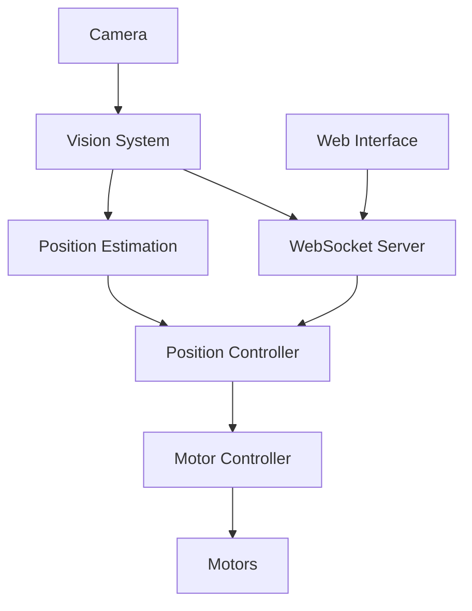

# System Architecture

## Overview

The robot control system is built on a multi-layered architecture with distinct components for vision, control, communication, and user interface.


## Core Components

### 1. Control System
- **Two-Level Control**
  - High-level position control (10Hz)
  - Low-level motor control (50Hz)
  ```
  Vision → Position Control → Velocity Control → Motors
  ```


### 2. Vision System
- Camera input processing (30Hz)
- ArUco marker detection
- Position estimation
- Environment mapping


### 3. Communication Layer
- WebSocket server
- Real-time data streaming
- Bi-directional control flow
- State synchronization


### 4. Web Interface
- Real-time visualization
- Control interface
- Status monitoring
- Configuration management


## Data Flow




## Threading Model

- Vision Thread (30Hz)
- Position Control Thread (10Hz)
- Motor Control Thread (50Hz)
- WebSocket Communication Thread
- Tracker Server Communication Thred (1Hz)
- Main Control Thread


## State Management

- Robot Position State
- Control Mode State
- Motor State
- Communication State


## Error Handling

- Vision System Failures
- Communication Timeouts
- Motor Control Errors
- Position Tracking Errors

